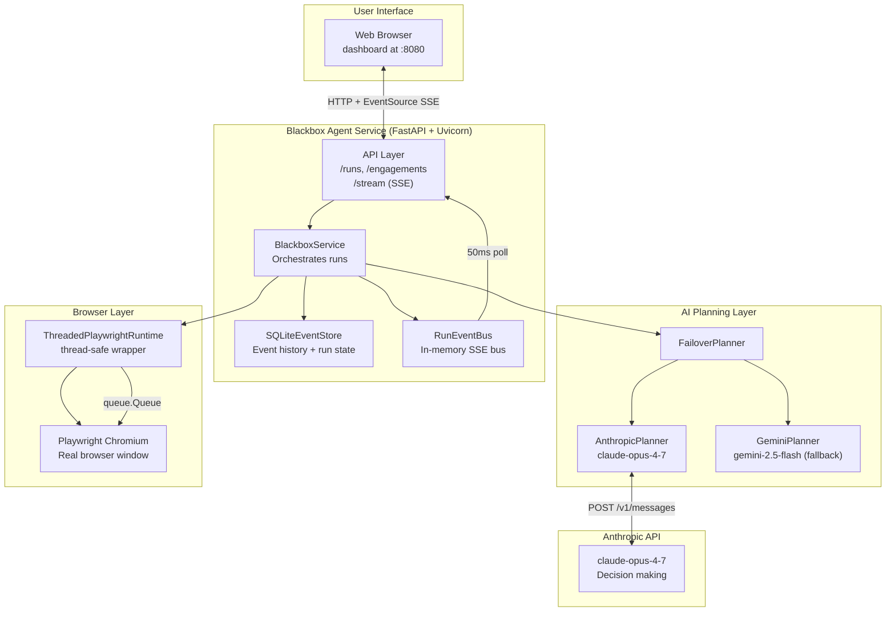
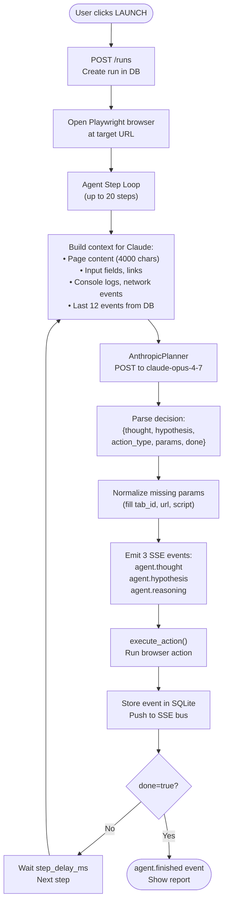
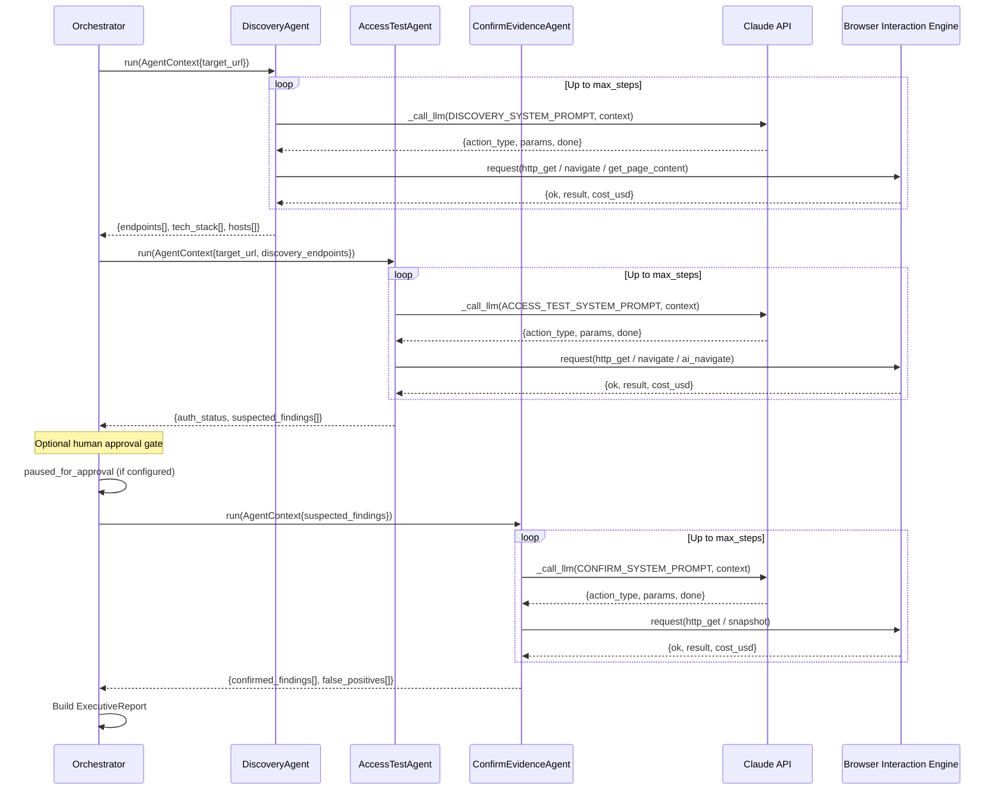
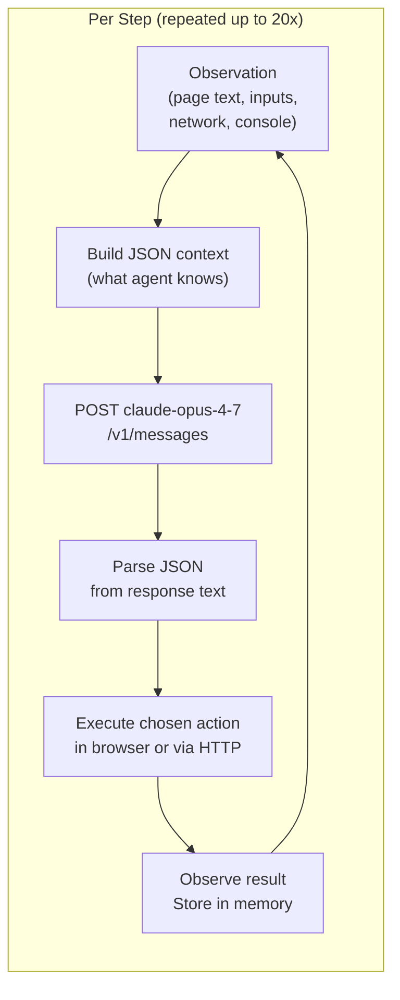
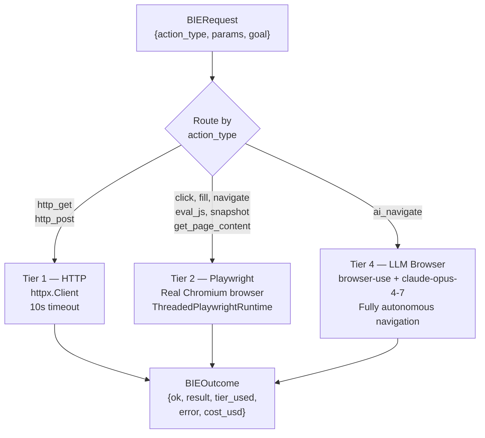
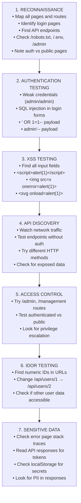
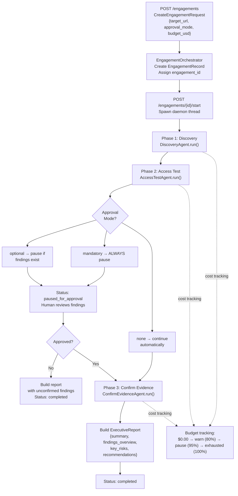
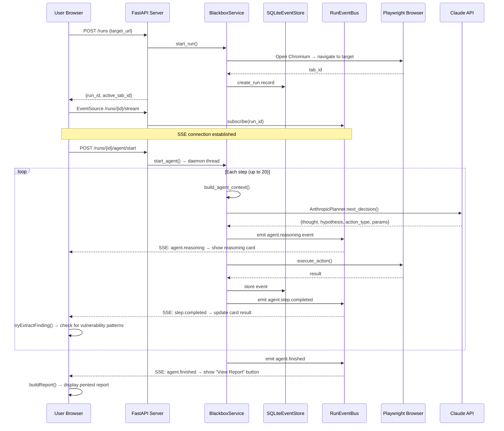
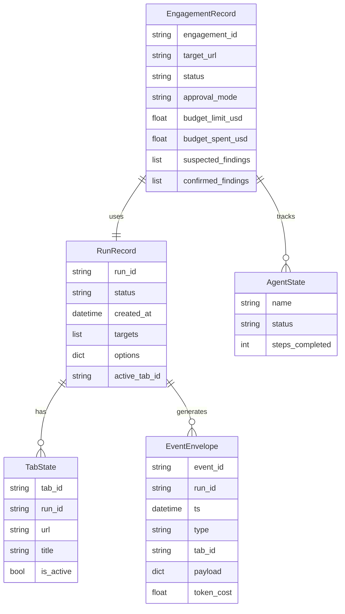

# Blackbox Agent — Complete Application Reference

> **Purpose:** This document is the single source of truth for presenting, understanding, and demonstrating the Blackbox Agent system. It covers architecture, agents, decision-making, technology, strengths, and limitations — everything needed to build a presentation or brief anyone on the system.

---

## 1. Executive Summary

**Blackbox Agent** is an autonomous AI-powered web application security testing platform. It takes a target URL, opens a real browser, and uses Claude (Anthropic's most capable LLM) to reason about how to find and exploit vulnerabilities — exactly the way a human security researcher would, but automatically and at scale.

The agent navigates the target application, reads page content, submits forms with attack payloads (SQL injection, XSS, etc.), reads network traffic, and produces a professional penetration testing report — all without any manual intervention after clicking **LAUNCH**.

**Core value proposition:** What takes a human pentester 8–16 hours of focused work, the Blackbox Agent can cover autonomously in 20 steps, with full reasoning transparency and a deliverable-quality report.

---

## 2. What It Does — End-to-End User Journey

```
User opens dashboard → types target URL → clicks LAUNCH
         │
         ▼
Playwright opens a real Chromium browser window pointing at target
         │
         ▼
Claude (LLM) observes the page (text, inputs, links, network)
and decides what to do next — every single step
         │
         ▼
Agent reasons step-by-step:
  Step 1: Read page content → "I see a login form"
  Step 2: Fill email with ' OR 1=1-- → "Testing SQL injection"
  Step 3: Read localStorage → "JWT token obtained — login bypassed!"
  Step 4: Navigate to /admin → "Testing broken access control"
  ...up to 20 steps...
         │
         ▼
Dashboard shows LIVE reasoning cards (thought → hypothesis → result)
Findings panel populates in real-time as vulnerabilities are detected
         │
         ▼
Agent finishes → "View Report" button appears
         │
         ▼
Professional pentest report generated in browser:
  - Target, date, duration, AI model used
  - Executive summary
  - Findings table sorted by severity (CRITICAL/HIGH/MEDIUM/LOW)
  - Per-finding: CWE, CVSS score, PoC payload, evidence, impact, remediation
  - Attack timeline
  - Copy / Print buttons
```

---

## 3. High-Level System Architecture



---

## 4. Technology Stack

| Component | Library / Tool | Version | Role |
|-----------|---------------|---------|------|
| **API Framework** | FastAPI | ≥0.115 | HTTP endpoints, SSE streaming, request routing |
| **ASGI Server** | Uvicorn | ≥0.30 | Serves FastAPI, handles concurrent connections |
| **Browser Automation** | Playwright (sync API) | ≥1.50 | Controls real Chromium browser — clicks, fills, reads |
| **Primary AI Model** | claude-opus-4-7 | via API | Autonomous security reasoning per step |
| **Fallback AI Model** | gemini-2.5-flash | via API | Transparent failover if Anthropic fails/rate-limits |
| **LLM HTTP Client** | httpx | ≥0.27 | Direct API calls to Anthropic and Gemini |
| **High-level Browser AI** | browser-use | ≥0.1.40 | Tier 4: LLM drives browser for complex auth flows |
| **LangChain Wrapper** | langchain-anthropic | ≥0.3.0 | ChatAnthropic for browser-use integration |
| **Data Validation** | Pydantic v2 | ≥2.8 | Type-safe models, JSON serialization |
| **Persistence** | SQLite (stdlib) | — | Event log, run records, tab state |
| **Config Loading** | python-dotenv | ≥1.2 | .env file → typed settings dataclass |
| **Thread Safety** | queue.Queue (stdlib) | — | Serializes Playwright calls to single owner thread |
| **Concurrency** | threading.Thread | stdlib | Background agent loops, engagement phases |
| **Dashboard** | Vanilla HTML/CSS/JS | — | Single-page app embedded in Python f-string |
| **Streaming** | Server-Sent Events | — | Real-time reasoning/event push to browser |

---

## 5. Agent Architecture

### 5a. The Main Agent Loop (Dashboard Path)

The simplest and most used path — one LLM driving a browser for up to 20 steps.



**What Claude receives each step (the context JSON):**
```json
{
  "run": { "run_id", "targets", "active_tab_id" },
  "tabs": [{ "tab_id", "url", "title", "is_active" }],
  "page_content": {
    "url": "http://localhost:3000/#/login",
    "title": "OWASP Juice Shop",
    "text": "visible page text (4000 chars max)",
    "inputs": [{ "tag", "type", "name", "id", "placeholder" }],
    "links": ["http://..."]
  },
  "recent_events": ["last 12 events"],
  "step_index": 5,
  "max_steps": 20,
  "allowed_actions": ["click", "fill", "navigate", "eval_js", ...]
}
```

**What Claude returns:**
```json
{
  "thought": "I see a login form. The email field is likely vulnerable to SQL injection.",
  "hypothesis": "SQLi ' OR 1=1-- in email field may bypass authentication",
  "action_type": "fill",
  "params": { "tab_id": "tab-abc", "selector": "#email", "value": "' OR 1=1--" },
  "done": false
}
```

**Planner failover:** `FailoverPlanner` wraps `AnthropicPlanner` (primary) and `GeminiPlanner` (backup). On any Anthropic exception, silently switches to Gemini for remaining steps.

### 5b. Allowed Browser Actions (13 total)

| Action | What It Does |
|--------|-------------|
| `get_page_content` | Read page text, inputs, links |
| `click` | Click a CSS selector |
| `fill` | Type into an input field |
| `navigate` | Navigate to a URL |
| `eval_js` | Execute JavaScript and return result |
| `read_console` | Get browser console logs |
| `read_network` | Get network request/response log |
| `snapshot` | Capture a screenshot |
| `open_tab` | Open a new browser tab |
| `switch_tab` | Switch between tabs |
| `inject_html` | Append HTML to page body |
| `wait_for_selector` | Wait for element to appear |
| `select_option` | Choose a dropdown option |

---

## 6. Three-Phase Engagement Pipeline

For deeper, structured pentesting via the `/engagements` API. Three specialized LLM-driven agents run sequentially.



### Phase Descriptions

| Phase | Agent | Goal | Key Actions | Output |
|-------|-------|------|-------------|--------|
| **1. Discovery** | `DiscoveryAgent` | Map attack surface | `http_get`, `get_page_content`, `navigate` | Endpoints, tech stack, auth boundaries |
| **2. Access Test** | `AccessTestAgent` | Find vulnerabilities | `http_get`, `navigate`, `ai_navigate`, `snapshot` | Suspected findings with evidence |
| **3. Confirm Evidence** | `ConfirmEvidenceAgent` | Verify & screenshot | `http_get`, `navigate`, `snapshot` | Confirmed findings vs false positives |

### How Agents Pass Data
```
Discovery output → ctx.state["discovery_endpoints"] → AccessTestAgent
AccessTest output → ctx.state["suspected_findings"] → ConfirmEvidenceAgent
```

Each agent receives a phase-specific `SYSTEM_PROMPT` telling Claude exactly what to do and what actions are available.

---

## 7. LLM Decision Making — How Claude Reasons



**Decision quality factors:**
- Claude sees the FULL page text (up to 4000 chars) — knows what's actually rendered
- Claude sees all form fields, buttons, input names — knows what to target
- Claude sees the last 12 events — has memory of what it already tried
- Claude's system prompt contains explicit pentesting methodology (SQLi → XSS → IDOR → API abuse)
- If Claude returns a partial decision (missing `tab_id`, `url`, etc.), `_normalize_decision()` auto-fills it

---

## 8. Browser Interaction Engine (BIE)

Three tiers of browser interaction, automatically routed by action type:



| Tier | Technology | Speed | Cost | Use Case |
|------|-----------|-------|------|----------|
| **Tier 1** | httpx (pure HTTP) | Fast (~0.5s) | ~$0.0001/call | Endpoint probing, API testing |
| **Tier 2** | Playwright Chromium | Medium (~1-3s) | ~$0.001/call | Real browser interactions, JS-heavy apps |
| **Tier 4** | browser-use + Claude | Slow (~10-30s) | ~$0.02/call | Complex auth flows where logic is unknown |

**Thread safety:** All Playwright calls go through a `queue.Queue` to a single dedicated browser owner thread. This prevents Playwright's thread-safety constraints from causing crashes.

---

## 9. Security Testing Methodology

The agent follows a structured pentesting approach, systematically working through attack categories:



**Vulnerability types detected and reported:**

| Vulnerability | CWE | CVSS | What the agent looks for |
|--------------|-----|------|-------------------------|
| SQL Injection | CWE-89 | 9.8 CRITICAL | `sqli`, `OR 1=1`, `union select` in hypothesis |
| XSS | CWE-79 | 7.2 HIGH | `xss`, `alert(1)`, `onerror` in hypothesis |
| IDOR | CWE-284 | 7.5 HIGH | `idor`, `insecure direct object` in hypothesis |
| Auth Bypass | CWE-287 | 9.1 CRITICAL | `auth bypass`, `bypassed auth` in hypothesis |
| Missing API Auth | CWE-306 | 7.5 HIGH | `missing auth`, `unauthenticated api` in hypothesis |
| Broken Access Control | CWE-285 | 8.1 HIGH | `admin accessible`, `admin bypass` in hypothesis |
| Sensitive Data Exposure | CWE-200 | 5.3 MEDIUM | `JWT found`, `token localStorage` in hypothesis |

---

## 10. Orchestrator & Approval Gate



---

## 11. Dashboard Real-Time Data Flow



---

## 12. Complete Data Architecture



---

## 13. Strengths & Pros

### ✅ True Autonomous Reasoning (Not Scripted)
Unlike traditional scanners (Burp Suite, OWASP ZAP) that run pre-written scripts, every action is decided by Claude based on what it actually observes. The agent adapts — if it finds a login form, it attacks it; if there's no login form, it explores elsewhere.

### ✅ Real Browser, Not Just HTTP
Many modern web apps (SPAs, React/Angular/Vue) require JavaScript execution. The agent uses a real Chromium browser — it sees the same page a user would, including dynamically loaded content.

### ✅ Full Reasoning Transparency
Every step shows Claude's complete thought process: what it observed, what vulnerability it hypothesizes, what action it takes, and what result it got. Not a black box — a glass box.

### ✅ Professional Output
The pentest report matches what a human security consultant would deliver: CWE references, CVSS scores, Proof-of-Concept payloads, impact statements, remediation guidance, copy/print support.

### ✅ Automatic Failover
If Anthropic's API is unavailable or rate-limited, the system silently switches to Google Gemini — zero downtime for the user.

### ✅ No Target Configuration
The agent performs blackbox testing — zero prior knowledge of the target. It discovers everything by interacting with the live application, making it applicable to any web application.

### ✅ Live Progress Visibility
Server-Sent Events push every reasoning step to the dashboard in real time. You watch the AI think and act — highly compelling for demonstrations.

### ✅ Budget-Aware (Engagement Pipeline)
The engagement pipeline tracks LLM cost per phase and can pause, warn, or stop when budget thresholds are hit — suitable for production use with cost controls.

---

## 14. Limitations, Cons & Bottlenecks

### ⚠️ Speed vs. Depth Trade-off
20 steps covers roughly 20 actions. A thorough manual pentest covers hundreds. The agent is designed for rapid initial assessment, not exhaustive coverage.

**Mitigation:** Increase `BLACKBOX_AGENT_MAX_STEPS` in `.env` (e.g., 50–100 steps for deeper coverage).

### ⚠️ LLM Cost Per Scan
At `claude-opus-4-7` pricing, a 20-step scan costs approximately $0.50–$2.00 depending on page content length. At 50 steps: $1.50–$6.00.

**Mitigation:** Gemini fallback is significantly cheaper. Can configure to use `claude-sonnet-4-6` as default (lower cost, still capable).

### ⚠️ CAPTCHA & Bot Detection
The agent cannot solve CAPTCHAs. Many production applications deploy bot detection (Cloudflare, reCAPTCHA) that blocks automated browsers.

**Mitigation:** Tier 4 `ai_navigate` uses a real browser profile and can sometimes handle simple bot detection. CAPTCHA bypass requires human intervention or third-party solving services (not implemented).

### ⚠️ Dynamic JavaScript-Heavy SPAs
Some SPAs load content lazily or require complex user flows (multi-step onboarding). The agent may miss content that loads only after specific interactions.

**Mitigation:** Claude can reason about SPA patterns and use eval_js to trigger lazy loading. Tier 4 browser-use handles complex multi-step flows.

### ⚠️ No State Persistence Between Runs
Each LAUNCH starts fresh. The agent has no memory of previous scans — if you scan the same target twice, it rediscovers everything.

**Mitigation:** SQLite stores all events — historical data could be used to seed future scans (not yet implemented).

### ⚠️ Playwright Thread Constraint
All Playwright calls must go through a single owner thread. High concurrency (many simultaneous scans) creates a queue bottleneck.

**Mitigation:** For multi-target production use, run multiple service instances (horizontally scalable via Docker).

### ⚠️ Rate Limits
Anthropic API has rate limits per tier. Heavy use (many concurrent scans) may hit RPM/TPM limits.

**Mitigation:** Gemini failover handles Anthropic rate limits automatically. Add `step_delay_ms` to slow down request rate.

### ⚠️ False Positives in Finding Detection
The live findings panel detects vulnerabilities by scanning Claude's hypothesis text for keyword patterns. A hypothesis mentioning "SQLi" to DESCRIBE a test may trigger a finding even if the test ultimately failed.

**Mitigation:** The 3-phase engagement pipeline's `ConfirmEvidenceAgent` specifically re-tests and filters false positives. The main dashboard scan finding detection is heuristic.

---

## 15. How to Run — Demo-Ready Commands

```bash
# ─── Prerequisites ─────────────────────────────────────────────
# 1. API key in .env:
#    ANTHROPIC_API_KEY=sk-ant-...

# ─── Start Target Application ──────────────────────────────────
# Juice Shop is a deliberately vulnerable web app (OWASP project)
docker run -d -p 3000:3000 bkimminich/juice-shop
# Wait ~30 seconds for startup, then verify: open http://localhost:3000

# ─── Start Blackbox Agent ──────────────────────────────────────
uv run lean_agent
# Service starts at http://localhost:8080
# Dashboard: http://localhost:8080 (auto-redirects)

# ─── Run a Scan ────────────────────────────────────────────────
# 1. Open http://localhost:8080 in browser
# 2. Target URL is pre-filled: http://localhost:3000
# 3. Click LAUNCH
# 4. Watch Chromium browser open and the agent start scanning
# 5. Reasoning cards appear in real-time
# 6. After 20 steps: click "View Report"

# ─── Key Configuration (.env) ──────────────────────────────────
# BLACKBOX_AGENT_MODEL=claude-opus-4-7    # AI model
# BLACKBOX_AGENT_MAX_STEPS=20             # Steps per scan
# BLACKBOX_BROWSER_HEADLESS=false         # Show browser window

# ─── Verify Everything Works ───────────────────────────────────
uv run pytest tests/ -q     # 32 tests, all pass
```

---

## 16. Repository Structure

```
blackbox-agent/
├── blackbox_service/           # Main Python package
│   ├── agent.py               # AnthropicPlanner + GeminiPlanner + FailoverPlanner
│   ├── api.py                 # FastAPI app + dashboard HTML (1000+ lines)
│   ├── service.py             # BlackboxService — core orchestration loop
│   ├── runtime.py             # InMemoryRuntime + PlaywrightRuntime + ThreadedRuntime
│   ├── settings.py            # Config loader from .env
│   ├── models.py              # Pydantic data models (RunRecord, TabState, etc.)
│   ├── store.py               # SQLiteEventStore (persistence)
│   ├── stream.py              # RunEventBus (SSE streaming)
│   ├── main.py                # Entry point → uvicorn
│   ├── demo.py                # demo_blackbox CLI command
│   ├── client.py              # BlackboxClient for external orchestrators
│   ├── agents_v2/             # Three-phase LLM agents
│   │   ├── base.py           # AgentBase + AgentContext + _call_llm()
│   │   ├── discovery.py      # DiscoveryAgent (attack surface mapping)
│   │   ├── access_test.py    # AccessTestAgent (auth + API testing)
│   │   └── confirm_evidence.py # ConfirmEvidenceAgent (verification)
│   ├── bie/                   # Browser Interaction Engine
│   │   └── engine.py         # Tier 1/2/4 routing + execution
│   ├── orchestrator.py        # EngagementOrchestrator (3-phase pipeline)
│   └── engagement_models.py   # EngagementRecord, BudgetState, findings models
├── tests/                     # 32 unit tests (no browser, no API key needed)
├── advancement.md             # Technical changelog vs original implementation
├── full_info.md               # This document
├── explanation.md             # Original system reference
├── Dockerfile                 # Container build
├── docker-compose.yml         # Juice Shop + Blackbox Agent together
├── pyproject.toml             # Dependencies + CLI entry points
└── .env                       # API keys (never committed)
```

---

## 17. Key Differentiators vs Traditional Security Tools

| Feature | Blackbox Agent | Burp Suite | OWASP ZAP | Manual Pentester |
|---------|---------------|-----------|----------|-----------------|
| **Reasoning** | LLM decides each step | Rule-based scripts | Rule-based scripts | Human judgment |
| **Adaptability** | Adapts to any app | Fixed test patterns | Fixed test patterns | Full adaptability |
| **Setup time** | 0 (blackbox) | Hours of config | Hours of config | Days of briefing |
| **Output** | Full pentest report | Raw scan results | Raw scan results | Professional report |
| **Transparency** | Full step reasoning | Minimal | Minimal | Manual notes |
| **Cost** | ~$1-5 per scan | $449/year | Free | $1000-5000/engagement |
| **Speed** | 5-10 minutes | Hours | Hours | Days |
| **JS-heavy apps** | ✅ Real browser | Partial | Partial | ✅ |
| **Novel attacks** | ✅ LLM reasoning | ❌ | ❌ | ✅ |
